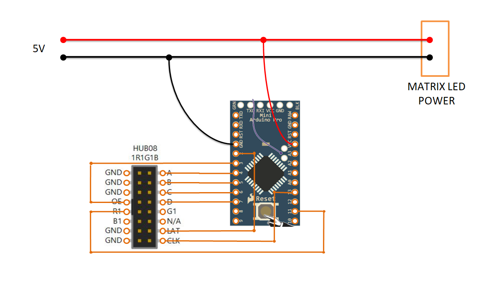

# RONN ANIMATION - V1.0
This is arduino library for creating animation on matrix led.  
> NOTE : only supports single color matrix led and HUB08 connector.

## Part
- **MATRIX LED** with connector **HUB08**. 
- **ARDUINO**, tested on ATMEGA328 (Arduino NANO, UNO and PRO MINI 5V version).

## Demo
Will be uploaded soon....

## How to install
Just download, open with arduino IDE and upload into arduino board (all libraries included).

## Wiring
HUB08 (matrix led) to ARDUINO pin connection
 - LA / A    -> Digital Pin 4
 - LB / B    -> Digital Pin 5
 - LC / C    -> Digital Pin 6
 - LD / D    -> Digital Pin 7
 - S / CLK   -> Digital Pin 13
 - R1 / R    -> Digital Pin 11
 - OE / EN   -> Digital Pin 3
 - L / LAT / STB -> Digital Pin 2

Example wiring on Arduino Mini board.


> SPI connection based from HUB08SPI.h, check into original library for details (https://github.com/emgoz/HUB08SPI).

## Usage
### Required libraries
~~~C
	#include <avr/pgmspace.h>
	#include <SPI.h>
	#include "HUB08SPI.h"
	#include "TimerOne.h"
	#include "Buffer.h"

	#define WIDTH   64 // width of led matrix (pixel)
	#define HEIGHT  16 // height of led matrix

	HUB08SPI display;
	uint8_t displaybuf[WIDTH * HEIGHT / 8];
	Buffer buff(displaybuf,64,16);

	//make sure to put after create buffer, because its just function to call library HUB08SPI & BUFFER
	#include "ronnAnimation.h" 
~~~
> All libraries included, you don't need to install manually.


### Animation function
First, you need create a font.  
Several fonts have been created, but you can also create your own. Check **Font Builder.xlsm** in the ***Tool*** folder.
> Fonts created based on the MD_MAX72xx library (only fonts, not include MD_MAX72xx libraries).  
> Original tool can be found at https://github.com/MajicDesigns/MD_MAX72XX

Default variable name for call the class is ***ronn***. So you can call a function like :
```C
	ronn.setFont(font_DEFAULT);
	ronn.printText("Demo Ronn Animation");
	etc...
```
#### 1. Set Font
For call the font
```C
	setFont(fontType_t *f=font_DEFAULT); //*f = variable font name
```
#### 2. Write text animation
```C
	printText(String string, int x, int y);   			// text,X,Y
	printText_R(String string, int x, int y, int s);  	// text,X,Y,speed --> print right with delay animation
	printText_RC(String string, int x, int y, int s);  	// text,X,Y,speed --> print right with delay and cursor animation
	printText_L(String string, int x, int y, int s);  	// text,X,Y,speed --> print left with delay animation (x = pixel in right position / end text)
	printText_LC(String string, int x, int y, int s);  	// text,X,Y,speed --> print left with delay and cursor animation 
	scanText_L(String string, int x, int y, int s);  	// text,X,Y,speed --> scan left animation
	scanText_R(String string, int x, int y, int s);  	// text,X,Y,speed --> scan right animation
```

#### 3. Scrolling text animation
Vertical Scroll
```C
	scrollText_U(String string, int x, int y, int w, int s=20);    //text,X,Y,width,speed --> scroll text up
    	scrollText_D(String string, int x, int y, int w, int s=20);    //text,X,Y,width,speed --> scroll text down
	
```
Scroll to left until first character in X position (until left character)
```C
	scrollText_LL(String string, int x, int y, int w, int s); //text,X,Y,width,speed (height auto from font height)
```
Scroll to left until last character (until right character)
> You can use this function for continues scroll text (put on loop)
```
	scrollText_LR(String string, int x, int y, int w, int s); //text,X,Y,width,speed (height auto from font height)
```

#### 4. Move animation
```C
	move_U(int st=1, int sp=35, int x=0, int y=0, int w=WIDTH, int h=HEIGHT); //step,speed,X,Y,width,height --> move up
	move_L(int st=1, int sp=35, int x=0, int y=0, int w=WIDTH, int h=HEIGHT); //step,speed,X,Y,width,height --> move left
	move_R(int st=1, int sp=35, int x=0, int y=0, int w=WIDTH, int h=HEIGHT); //step,speed,X,Y,width,height --> move right
	move_D(int st=1, int sp=35, int x=0, int y=0, int w=WIDTH, int h=HEIGHT); //step,speed,X,Y,width,height --> move down
```
Custom move
```C
	moveTo(char* moving[], int sp=35, int x=0, int y=0, int w=WIDTH, int h=HEIGHT); //array direction & step,speed,X,Y,width,height
```
example using moveTo:
```C
    char* moving[] = {"D:6", "P:500", "L:20", "U:2","R:41","E:0"};
    
    // move all area
    ronn.moveTo(moving);
    
    // move spesific area
    ronn.moveTo(moving,20,16,0,5,5);

```
Result:  
Move down 6 pixel --> parking 500ms --> move left 20 pixel --> move up 2 pixel --> move right 41 pixel --> end


#### 5. Clear animation
Clear spesific location
```C
    clear_L(int x, int y, int w, int h, int m);  //X,Y,width,height,mode(SCROLL,CLEAR) --> clear left
    clear_R(int x, int y, int w, int h, int m);  //X,Y,width,height,mode(SCROLL,CLEAR) --> clear right
    clear_D(int x, int y, int w, int h, int m);  //X,Y,width,height,mode(SCROLL,CLEAR) --> clear down
    clear_U(int x, int y, int w, int h, int m);  //X,Y,width,height,mode(SCROLL,CLEAR) --> clear up 
```

Clear all pixel on display
```C
	clear_L(int m);  //mode(SCROLL,CLEAR); --> clear left
	clear_R(int m);  //mode(SCROLL,CLEAR); --> clear right
	clear_D(int m);  //mode(SCROLL,CLEAR); --> clear down
	clear_U(int m);  //mode(SCROLL,CLEAR); --> clear up
```

Clear slice
```C
	clearSlice_L(int x, int y, int w, int h);  //X,Y,width,height --> clear slice left
	clearSlice_R(int x, int y, int w, int h);  //X,Y,width,height --> clear slice right
	clearSlice_L(); // all pixel --> clear slice left
	clearSlice_R(); // all pixel --> clear slice right
```

Other clear animation
```C
	clear_A1(); // all pixel --> random pixel and scroll to center
	clear_A2(); // all pixel --> blink out
```

#### 6. Bitmap
Yup, apart from fonts, you can also create images from bitmaps.  
Bitmap function actually from BufferGraphics libraries, check into original library for details, or you can check from the sample sketch.  
Tool for creating bitmaps can be found in ***Tool*** folder (Monochrome Bitmap to Code Coverter.exe), or you can download from original repository (https://github.com/emgoz/BufferGraphics)

## License and credits
Ronn Animation under MIT license.  
Other libraries follow their own license.
- HUB08SPI.h under MIT License (https://github.com/emgoz/HUB08SPI)
- BufferGraphics under MIT License (https://github.com/emgoz/BufferGraphics)
- TimerOne (https://github.com/PaulStoffregen/TimerOne)
- Part of font (https://github.com/MajicDesigns/MD_MAX72XX)


	
